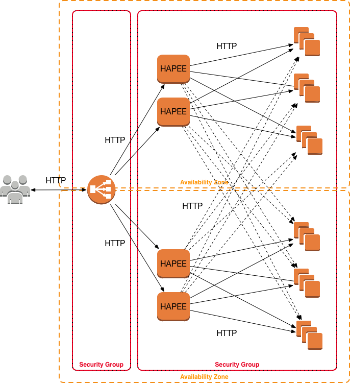

# HAPEE + AWS ALB Stack

This is a a slightly more advanced [Terraform](https://www.terraform.io/) code to build a HA stack as demo of best HAProxy Enterprise [HAPEE](https://www.haproxy.com/products/haproxy-enterprise-edition/) AWS practices.

As opposed to a AWS Classic ELB example we have shown before, we are now here utilising AWS ALB in a multi-zone setup and doing cross-zone balancing to better even the load. Each zone has 2 or more HAPEE Load Balancers and at least 3 or more Web servers with the same application. Typically ALB is situated in at least 2 Availability Zones while Classic ELB does not have such hard requirement.

This stack consists of the following key resources:

- configurable amount of Availabity Zones in use, as per _aws\_az\_count_ variable (default 2)
- configurable amount of Web servers in each Availability Zone, as per _web\_cluster\_size_ variable (default 3)
- configurable amount of HAPEE load-balancers in each Availability Zone, as per _hapee\_cluster\_size_ variable (default 2)
- a single AWS ALB with all HAPEE instances as a Target Group Attachment

Network-wise, stack uses CIDR **20.0.0.0/8** in a single VPC evenly split into multiple zones.

Security-wise, ALB has its own SG which allows **tcp/22** (SSH) and **tcp/80** (HTTP) from anywhere. HAPEE and Web server instances have two SG which allow **tcp/80** (HTTP) and **tcp/9080** (HTTP Health Probes) from ELB SG only, and **tcp/22** (SSH) from anywhere.

HAPEE backend server list is being auto-generated from Web server private IP list and passed through AWS User Data to build a correct HAPEE config file. PROXY protocol is not supported in AWS ALB and therefore is not enabled.

Real life situation would:

- use HTTPS and HTTP/2 on ALB
- have more complex path matching etc. rules on ALB
- optionally use HTTPS on backends as well
- have more complex anti-DOS, connection tracking, device fingerprinting etc. rules in HAPEE configuration
- have more serious Web server
