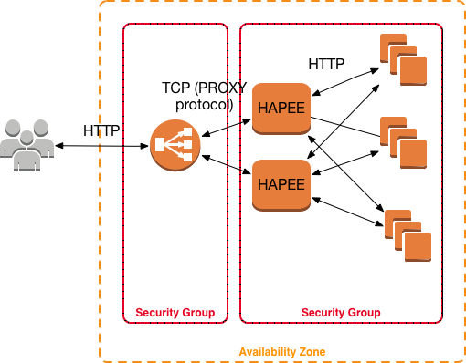

# HAPEE + AWS ELB Stack

This is a simple [Terraform](https://www.terraform.io/) code to build a HA stack as demo of best HAProxy Enterprise [HAPEE](https://www.haproxy.com/products/haproxy-enterprise-edition/) AWS practices.

We are using here AWS Classic ELB in single-AZ and as a plain HTTP front-facing Load Balancer and utilising PROXY protocol to pass the TCP traffic to 2 or more HAPEE Load Balancers. HAPEE balancers are then proxying HTTP traffic towards Web servers (3 or more).

This stack consists of the following key resources:

- configurable amount of Web servers, as per _web\_cluster\_size_ variable (default 3)
- configurable amount of HAPEE load-balancers, as per _hapee\_cluster\_size_ variable (default 2)
- a single AWS ELB in TCP [PROXY protocol](https://www.haproxy.com/blog/haproxy/proxy-protocol/) mode

Network-wise, stack uses CIDR **20.0.0.0/8** in a single VPC and a single AZ (later ALB example will show how to use multiple AZ setup and cross-zone balancing).

Security-wise, ELB has its own SG which allows **tcp/22** (SSH) and **tcp/80** (HTTP) from anywhere. HAPEE and Web server instances have two SG which allow **tcp/80** (HTTP) and **tcp/9080** (HTTP Health Probes) from ELB SG only, and **tcp/22** (SSH) from anywhere.

HAPEE backend server list is being auto-generated from Web server private IP list and passed through AWS User Data to build a correct HAPEE config file.

Real life situation would:

- use multiple AZ and cross-zone balancing
- use HTTPS on ELB
- optionally use HTTPS on backends as well
- have more complex anti-DOS, connection tracking, device fingerprinting etc. rules in HAPEE configuration
- have more serious Web server
